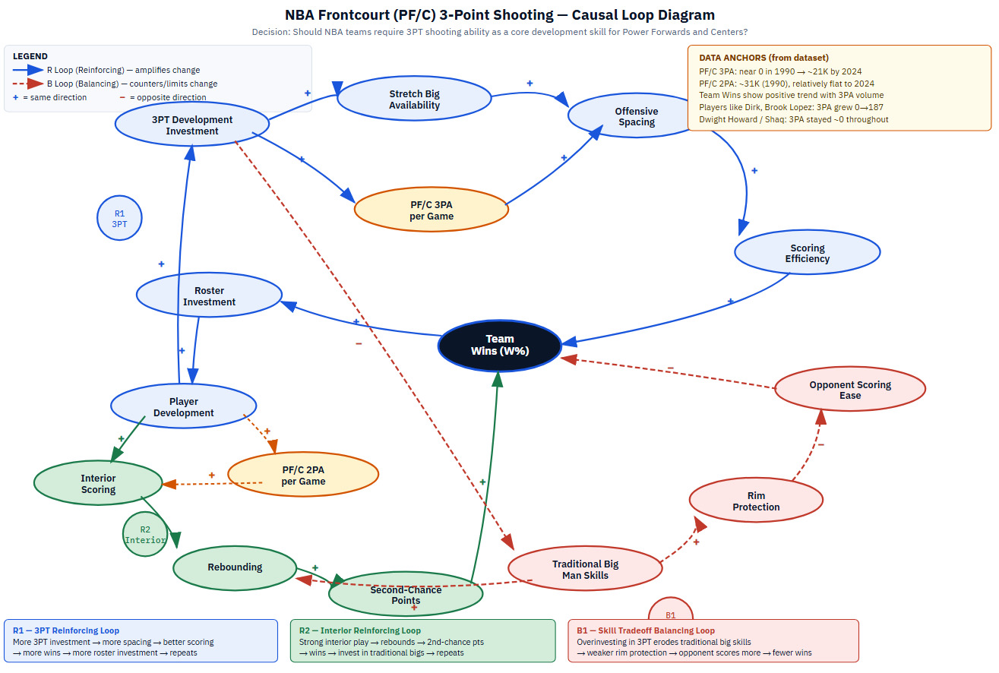
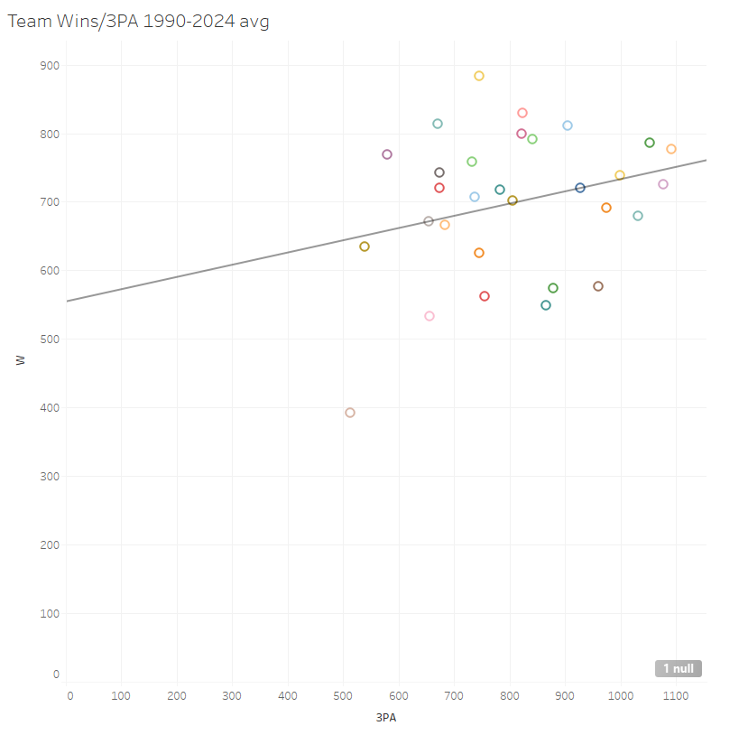
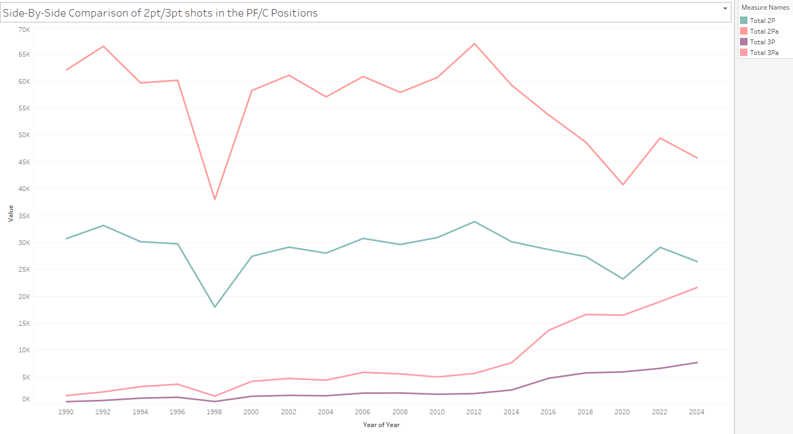
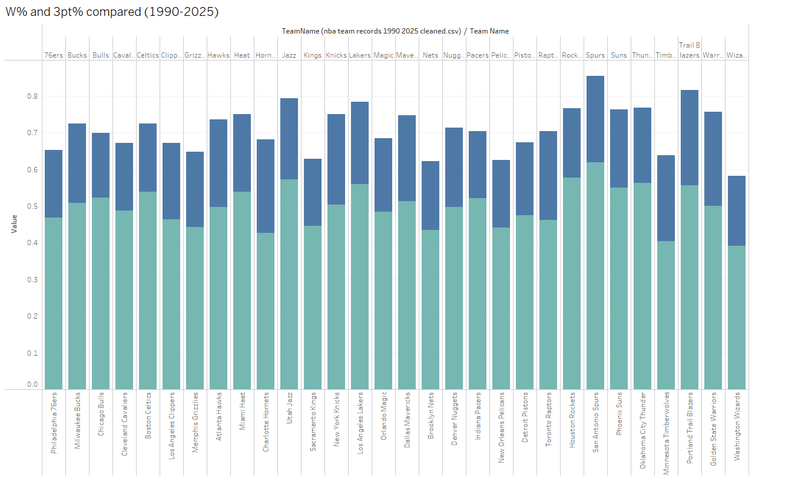
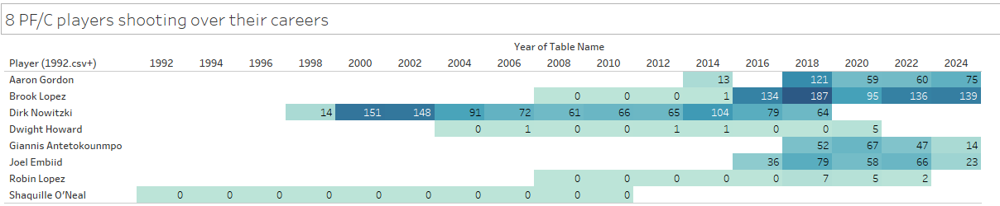

# Should NBA teams require 3PT shooting in PF-C positions?
This project analyzes how the role of NBA power forwards and centers has evolved over the past 30 years. Using shooting data, it investigates whether frontcourt players have shifted toward perimeter shooting and evaluates whether three-point shooting should be a required skill in modern big-man development.

## Decision Statement

Should NBA teams require three-point shooting ability as a core development skill for power forwards and centers when constructing rosters and training frontcourt players?

## Executive Summary

Over the past several decades, the NBA has experienced a major shift in offensive strategy. Earlier eras of basketball relied heavily on interior scoring from traditional big men, who were primarily responsible for rebounding, post play, and rim protection. In contrast, modern NBA offenses increasingly emphasize spacing and perimeter shooting. As three-point shooting has grown in importance, many power forwards and centers have expanded their roles beyond the paint and begun contributing as outside shooters.

This project investigates whether the role of NBA power forwards and centers has shifted toward perimeter shooting over the past thirty years. Using a dataset of frontcourt player shooting statistics compiled from multiple seasons, the analysis examines trends in shot selection, including changes in three-point attempts and two-point attempts over time. The project also explores how these changes relate to broader strategic trends in the league.

The results of this analysis will help inform a key decision faced by NBA front offices and coaching staffs. Teams must decide whether to prioritize traditional interior big men or invest in developing “stretch bigs” who can shoot from the perimeter. Understanding how the role of frontcourt players has evolved can provide valuable insight into whether three-point shooting should now be considered a required skill for modern NBA power forwards and centers.

## Table of Contents

- [Background](#background.md)
- [Data Sources](#citations-APA)
- [Exploratory Findings](#visualizations)
- [System Dynamics](#cld-diagram)
- [Analysis](#implications-for-the-decision-based-on-dashboard)
- [Recommendations](#recommendations)
- [Limitations](#limitations)
- [Future Works](#future-work)
- [References](#references)

## Dashboard

https://mquhenygrt4mwu54cltrxz.streamlit.app/ 

### Implications for the Decision based on dashboard:

The analysis in this dashboard suggests that three-point shooting from power forwards and centers has become much more important over time, both at the league level and in relation to team performance. The league trend visualizations show a clear increase in frontcourt three-point attempts and makes, while the player adaptation charts show that not all PF/C players adjusted in the same way. Some players, such as Brook Lopez and Dirk Nowitzki, adapted strongly to the growing role of perimeter shooting, while more traditional big men remained focused on interior play. The team success analysis also suggests that teams with greater three-point involvement from their PF/C positions often performed better, indicating that frontcourt spacing may now be a meaningful part of winning strategy.

Based on this evidence, the more promising option appears to be valuing PF/C players who can contribute to floor spacing and perimeter offense rather than relying only on traditional inside scoring. This does not mean that all big men must become high-volume shooters, but it does suggest that versatility has become more valuable in the modern NBA. At the same time, there are still uncertainties. Team success depends on many factors beyond PF/C shooting, including guard play, defense, coaching, and overall roster construction, so the patterns shown here should not be treated as proof of direct causation.

Overall, the findings point toward the growing strategic value of adaptable frontcourt players. In Milestone 4, I will build on this analysis to recommend how decision-makers should evaluate the importance of PF/C shooting when considering team-building and player value in the modern game.

Note: Instructions on how to use the dashboard, is found in the "How to page" 

## CLD diagram 

This causal loop diagram shows that frontcourt three-point shooting is not an isolated trend. It sits inside a larger system of development, roster strategy, offense, defense, and winning. The first major loop is R1, the three-point reinforcing loop. When teams invest more in three-point development for power forwards and centers, they increase the supply of stretch bigs. That raises PF/C three-point attempts per game, improves offensive spacing, and helps scoring efficiency. Better scoring supports more wins. More wins then encourage further roster and player development investment, which strengthens the same pattern. This loop helps explain why PF/C three-point volume grew so sharply over time.

The second major loop is R2, the interior reinforcing loop. Player development can also improve interior scoring. Strong interior play supports rebounding and creates second-chance points. Those outcomes help teams win, and winning encourages continued investment in those same inside skills. This loop shows why the rise of the three-point shot did not erase the value of traditional frontcourt play. Interior scoring still matters, especially when it leads to extra possessions and efficient offense near the basket.

The third major loop is B1, the skill tradeoff balancing loop. If teams push too far toward perimeter shooting, they may weaken traditional big-man skills. That can reduce rim protection, make opponent scoring easier, and hurt team wins. This loop acts as a limit. It shows that more three-point shooting is not always better if it comes at the cost of defense and interior presence.

Together, these loops explain the pattern shown in the data. PF/C three-point attempts rose sharply, some players adapted well, and team success often moved with greater frontcourt shooting. At the same time, the system suggests that the best option is not to abandon inside play. The key intervention point is player development and roster investment. These variables shape both the perimeter path and the interior path. For the decision-maker, the lesson is clear: teams should value PF/C players who can stretch the floor, but they should not sacrifice rebounding, rim protection, and interior scoring to do it.

## Visualizations

1. Team Wins vs PF/C 3PA (1990–2024 avg)

This scatterplot explores the relationship between team success and the average number of three-point attempts taken by power forwards and centers. The upward trendline suggests that teams whose PF/C players attempt more threes also tend to have more wins over time. While this does not prove that PF/C shooting alone causes success, it does show a positive association between frontcourt three-point involvement and winning. This matters for the decision-maker because it suggests that the growing use of perimeter shooting by big men may be connected to stronger overall team performance, making it an important factor to consider when evaluating how the PF/C role has changed in the modern NBA.

2. Side-by-Side Comparison of 2PT/3PT Shots in the PF/C Positions

This visualization shows how shot selection for power forwards and centers has changed from 1990 to 2024 by comparing total two-point attempts and makes with total three-point attempts and makes. The chart shows that two-point shots still remain the larger share of PF/C offense, but three-point attempts and makes rise significantly over time, especially in the more recent years. This reveals that frontcourt players are no longer limited to traditional inside scoring roles and are becoming more involved in floor spacing and perimeter offense. For the decision-maker, this is important because it shows that the role of PF/C players has clearly evolved, and any decision about player value, team strategy, or offensive structure needs to reflect that shift.

3. W% and 3PT% Compared (1990–2025)

This chart compares team win percentage with PF/C three-point percentage across NBA teams. It shows that stronger teams often pair higher winning percentages with relatively solid three-point shooting from their frontcourt players, although the relationship is not perfectly consistent across every franchise. The main takeaway is that efficient three-point shooting from PF/C players may help support team success, but it is likely one piece of a larger system that also includes roster construction, guard play, defense, and coaching strategy. This matters for the decision-maker because it suggests that efficiency from big men on the perimeter is relevant, but should be evaluated alongside other contributors to success rather than on its own.

4. 8 PF/C Players Shooting Over Their Careers

This heatmap highlights how selected PF/C players adapted to the increased importance of the three-point shot over the course of their careers. The pattern shows a clear divide between traditional big men, such as Shaquille O’Neal and Dwight Howard, who contributed very little from three, and more modern or adaptable frontcourt players such as Brook Lopez, Joel Embiid, and Aaron Gordon, who show much greater three-point involvement in later seasons. Dirk Nowitzki also stands out as an early example of a big man who helped redefine the position through perimeter shooting. This matters for the decision-maker because it demonstrates that the league-wide trend seen in the team data is also visible at the player level, showing that adaptation to the three-point era has become a meaningful part of how PF/C players create value.

## Recommendations

NBA teams should treat three-point shooting as an important core development skill for power forwards and centers, but not as an absolute requirement in every case.

The project shows that frontcourt shooting has grown sharply over time and has become closely tied to the modern structure of NBA offense. Power forwards and centers now play in a league that values spacing, quicker ball movement, and offensive versatility. Our visualizations showed that PF/C three-point attempts increased substantially across the period studied, while player examples such as Dirk Nowitzki, Brook Lopez, and Joel Embiid showed that frontcourt players who adapted to the three-point era often became more valuable within modern systems. The team-level analysis also suggested a positive relationship between greater PF/C three-point involvement and team success, which supports the idea that perimeter-capable big men can strengthen roster construction.

That said, the evidence does not support a simple rule that every frontcourt player must become a high-volume shooter. The causal loop diagram showed an important tradeoff: if teams overemphasize perimeter shooting, they risk weakening traditional big-man strengths such as rim protection, rebounding, interior scoring, and physical presence. Those skills still matter. The strongest conclusion, then, is not that teams should replace traditional frontcourt play, but that they should develop players who can add shooting ability without losing the interior skills that still drive winning.

The best recommendation is for NBA teams to make three-point shooting a standard part of PF/C development, especially at the power forward position and for centers with the mobility to contribute offensively outside the paint. Teams should prioritize adaptability, not uniformity. Frontcourt players do not all need to become elite shooters, but they should be able to threaten defenses enough to support spacing and fit modern offensive systems.

In practical terms, teams should build rosters around balanced frontcourt versatility. They should value players who can stretch the floor when needed, while still protecting the rim, rebounding, and finishing inside. Based on the evidence from this project, the most effective strategy is not requiring every PF/C player to be the same, but making three-point shooting a core developmental expectation within a broader frontcourt skill set.

## Limitations

This project has several limitations. First, the analysis relies on observational basketball data, so it can show patterns and relationships but cannot prove direct causation. Teams that win more may have stronger PF/C shooting, but they also tend to have better guards, coaching, defense, depth, and overall roster construction. Because of that, frontcourt three-point shooting should be understood as one important factor within a larger system, not the sole cause of team success.

Second, the data is simplified in ways that limit precision. Much of the project uses team-level aggregates and selected player examples, which are useful for identifying broad trends but do not capture every strategic detail. A team may show strong PF/C three-point volume for different reasons, such as one elite stretch big, a spacing-heavy offensive system, or weak interior options. In the same way, focusing on a small group of players helps illustrate adaptation over time, but it does not fully represent every frontcourt player in the league.

Third, the structure of the player shooting data limits the time analysis. Some files are organized in two-year intervals rather than a complete season-by-season format. This makes long-term trends visible, but it reduces the detail available for year-to-year change. Earlier eras also contain very little PF/C three-point activity, so comparisons across the full period can sometimes make the shift look even more dramatic simply because the modern game has expanded the role so much.

## Future Work

Future work could strengthen this project in several ways. A more advanced version could include additional variables such as pace, offensive rating, defensive rating, rebound percentage, playoff success, and salary data to better isolate the role of frontcourt shooting in team performance. This would give a more complete picture of how PF/C shooting interacts with the larger system of winning basketball.

It would also be useful to separate power forwards and centers more fully, since the expectations for those positions are no longer identical. Some teams ask centers to stretch the floor, while others still rely on them primarily for screening, rebounding, and rim protection. A clearer positional split would improve the analysis.

Another valuable next step would be a deeper player development study. This could track when frontcourt players added a credible three-point shot and examine how that affected their minutes, usage, efficiency, and team role. Finally, future work could apply regression or machine learning methods to estimate the relative importance of PF/C shooting compared with other contributors to winning. That would help move the project from trend analysis toward stronger decision support.

# References

Python Software Foundation. (2026). Python documentation (Version 3.14.3). https://docs.python.org/3/ 

Streamlit. (2026). Streamlit documentation. https://docs.streamlit.io/

The pandas development team. (2026). pandas documentation. https://pandas.pydata.org/docs/reference/index.html#api 

Plotly Technologies Inc. (2026). Plotly Python graphing library documentation. https://plotly.com/python/ 

OpenAI. (2026). ChatGPT 5.1, 5.2 [Large language model]. https://chatgpt.com/?utm_source=chatgpt.com 

API Used to access data (2026) NBA.com https://github.com/swar/nba_api

Basketball-Reference. (2025). NBA player totals statistics (1990–2024 seasons). Sports Reference LLC. https://www.basketball-reference.com/leagues/NBA_2025_totals.html

National Basketball Association. (2024). NBA statistics. https://stats.nba.com